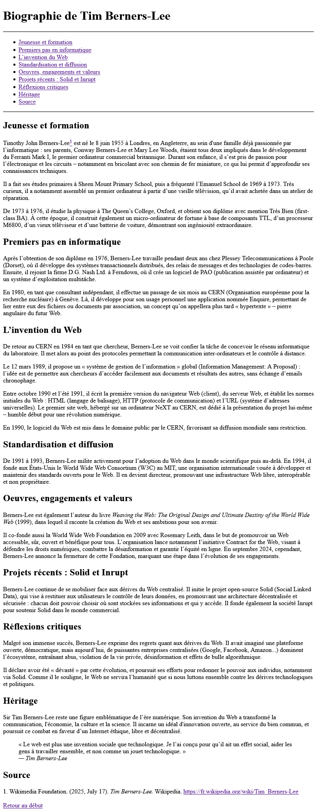

# Structure de page HTML et texte

## Objectifs

- Créer la structure de base d'une page HTML
- Structurer une page avec les balises sémantiques
- Ajouter du texte dans une page HTML
- Ajouter des liens hypertexte

## Consignes

### Initialisation du projet

- Creez un répertoire nommé **ex01_structure** dans votre répertoire **designweb**.
- Dans ce répertoire créez un fichier **index.html**
- Téléchargez le fichier [ex01_texte.docx](../ressources/ex01_texte.docx) et copiez le dans votre répertoire de projet dans un sous-dossier **ressources**

### Structure de la page HTML

- Dans le fichier **index.html**, créez la structure de base d'une page HTML5. (Vous pouvez utilisez le raccourci ==!==)
- Le titre de la page est **Ex01 - Struture de page HTML et texte**

Utilisez les informations suivantes pour les balises `meta`

| Propriété     | Valeur                          |
|------------|------------------------------------------|
| `charset`   | `UTF-8` |
| `viewport`   | `width=device-width, initial-scale=1.0` |
| `title`   | `Tim Berners-Lee` |
| `description`   | Décrivez le contenu de votre page |
| `author`   | Vous |

- Faites en sorte que votre page puisse être indexé dans les moteurs de recherches
- Ne fournissez pas de valeur pour les propriétés Open Graph et Twitter Card.

### Division de la page

Utilisez les balises sémantique suivantes pour diviser votre page: 

- Une balise `main` dans laquelle vous ajouterez une balise `article` (Tout le contenu qui suivra sera dans cette balise).
- Dans la balise `article`, ajouter aussi une balise `header` et une balise `nav`.
- Copiez l'entièreté du texte du fichier 

!!! Attention 

    Utilisez l'indentation adéquatement tout au long de votre page

### Contenu de la page

Copiez l'entièreté du texte du fichier dans la balise `<article>`, sous la balise `<nav>`.

#### header

- Ajoutez un titre de niveau 1 avec le texte `Biographie de Tim Berners-Lee`
- Ajoutez une ligne de séparation

#### nav

- Ajoutez le titre de niveau 2 `Sommaire`
- Ajoutez les éléments suivants, chacun sur une ligne.
- Vous pouvez utiliser la balise `<br>` pour faire un saut de ligne ou utiliser une liste à puce (Google est ton ami)
- Les éléments sont des sous-titres qui se retrouve dans le texte plus bas. Faites en sorte qu'en cliquant sur un des éléments l'utilisateur soit dirigé vers le sous-titre correspondant.
- Ajoutez une ligne de séparation à la fin du sommaire

**Sous-titres à ajouter dans le sommaire**

```title="Sous-titres à ajouter dans le sommaire"
Jeunesse et formation
Premiers pas en informatique
L’invention du Web
Standardisation et diffusion
Oeuvres, engagements et valeurs
Projets récents : Solid et Inrupt
Réflexions critiques
Héritage
```

#### Texte

- Chaque sous-titre doit être un titre de niveau 2.
- Chaque paragraphe doit être dans la balise approprié.
- Les mots qui sont en caractère gras dans le document Word doivent aussi l'être dans votre page.
- Il y a une série de mots en italique dans le texte, j'ai mis un commentaire dans le fichier Word pour vous indiquez où.
- La citation à la fin du texte doit être formatée avec les balises adéquates.
- Formatez correctement la source à la fin du texte. L'url doit s'ouvrir dans un nouvel onglet.
- À la première, ajoutez un lien hypertexte directement après `Timothy John Berners-Lee` qui dirigera vers la source en fin de texte. Le texte du lien doit être un `1` en exposant.

#### footer

- Ajoutez une balise `<footer>` à la fin du texte (mais toujours à l'intérieur de la balise `<article>`)
- Ajoutez le lien hypertexte `Retour au début` qui déplacera la page au tout début (au titre principal).

## Remise

- Une fois le travail terminé, compressez le répertoire de votre exercice et remettez le dans le devoir Teams.

## Aperçu du rendu

Voici un aperçu du rendu final (J'ai reduit la largeur de mon navigateur pour cet aperçu).

<figure markdown>
  {.center .shadow}
  <figcaption>Aperçu du résultat final</figcaption>
</figure>