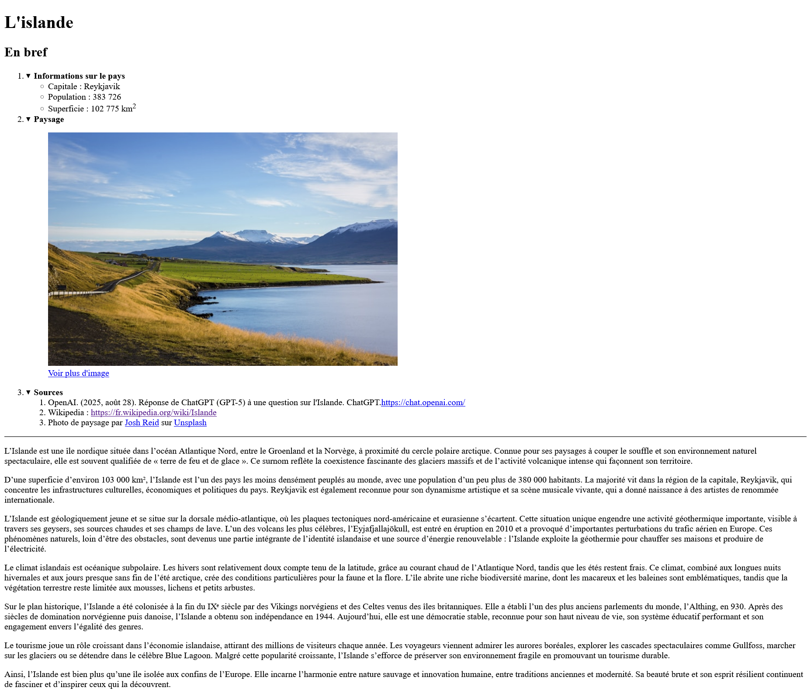
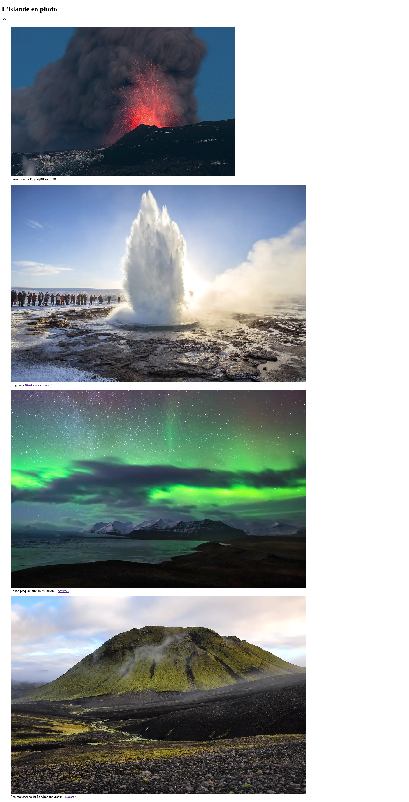

# Présentation d'un pays

## Objectif

- Intégrer des images
- Comprendre le fonctionnement de la balise `
`
- Réinvestir les notions de structure et de formatage de texte.

## Initialisation de l'exercice

- Creez un répertoire nommé **ex02_pays** dans votre répertoire **designweb**.
- Dans ce répertoire créez un répertoire **assets** et dans celui-ci un sous-répertoire **images** 
- Créez un fichier **index.html** et un fichier **noDA_paysage.html** à la racine du projet avec la structure de base d'une page web.
- Effectuez les ajouts suivants dans les deux fichiers.

!!! warning "Important"

    Pour cette exercice, TOUS vos fichiers doivent avoir le préfixe **noDA_** (2541234_paysage.html, 2541234_Volcan.png, etc.)
    à l'exception de votre fichier **index.html**

### Recherche de medias

Dans ce travail vous allez créer une page d'information sur le pays de votre choix et une page affichant des photos de paysage du pays.

- Choisissez un pays avec lequel travailler. Si vous êtes en manque d'inspiration essayer le [Country Picker Wheel](https://pickerwheel.com/tools/random-country-generator/){target=_blank}
- Demandez à ChatGPT de vous faire une description de 500 mots sur le pays.
- Accédez à la page Wikipedia pour récupérer des informations (vous en aurez besoin plus loin).

### La balise `
`

Pour ce travail vous allez devoir utiliser la balise `
`. Faites une rechercher pour comprendre le fonctionnement de la balise. Assurez-vous de bien comprendre les explications qui vous sont fournies.

### Favicon

Dans votre page **index.html** vous devez ajouter un favicon en format ICO du drapeau du pays. 

- L'image du drapeau peut être téléchargée depuis la page Wikipedia de votre pays.
- Utilisez le site [https://www.favicon.cc/](https://www.favicon.cc/){target=_blank} pour créer votre icône. Vous pouvez facilement téléverser une image et la convertir.
- Ajoutez le favicon à vos deux pages HTML.

## index.html

Utilisez les balises sémantiques qui vous semble les plus appropriées pour faire le découpage de votre page. Voici un exemple du résultat attendu. 

<figure markdown>
  {.center .shadow}
  <figcaption><a href="../../images/ex02_layout_index.png" target="_blank">Ouvrir en taille réelle</a></figcaption>
</figure>

Le nom de la page (balise `<title>`) est le nom de votre pays.

### Entête

- Ajoutez simplement le nom du pays comme titre de niveau 1

### Section "En bref"

- Utilisez un titre de niveau 2 pour le sous-titre `En bref`.
- Insérez ensuite une liste à puces numérotées.
- Dans chaque items de la liste il y a une balise `
`.
- Le texte des `
` doit être en caractère gras.
- Voici plus de détail sur chaque item de la liste.

#### 1. Information sur le pays

- Contient une liste à puces.
- Les items sont la Capitale, la Population et la Superficie du pays avec les informations adéquate. (Vous trouverez facilement les informations sur Wikipedia)

#### 2. Paysage

- Trouvez une photo d'un paysage de votre pays et utilisez la balise `<figure>`
- L'image doit avoir au maximum 600 pixels. Si elle est plus grande faites les ajustements nécessaire.
- Dans une balise `<figcaption>`, insérez un lien vers la page **noDA_paysage.html** et assurez-vous qu'elle s'ouvre dans un nouvel onglet.
- Le texte du lien est `Voir plus d'images`

#### 3. Sources

- Une liste à puces numérotées pour donner les sources de votre recherche
- Pour la référence à ChatGPT (que vous avez utilisé pour générer le texte plus bas), demandez lui comment le citer correctement selon la norme APA7 et ajoutez la référence au point 1.
- À l'item 2, ajoutez une référence à la page Wikipedia où vous avez trouvé les informations sur votre pays.
- Enfin ajoutez une référence au site où vous avez trouvez l'image.
- Terminez cette section par un trait horizontale.

### Texte descriptif

- Copiez le texte que vous a généré ChatGPT à la suite de la page et **formatez le correctement en paragraphes**.

### Note de bas de page

- Inscrivez à la toute fin de la page le texte `Conception [Votre Nom] - 2025`.
- Formatez le texte à votre guise.

---

## paysage.html

Utilisez les balises sémantiques qui vous semble les plus appropriées pour faire le découpage de votre page. Voici un exemple du résultat attendu. 

<figure markdown>
  {.center .shadow}
  <figcaption><a href="../../images/ex02_layout_paysage.png" target="_blank">Ouvrir en taille réelle</a></figcaption>
</figure>

- Le titre est de niveau 1.
- Sous le titre ajoutez un icône qui représente un retour à l'acceuil. 
- L'icône doit être au format SVG, soit un fichier de ce type ou la balise `<svg>`
- Faites vos recherche sur [Google icon](https://fonts.google.com/icons){target=_blank} ou [Font awesome](https://fontawesome.com/){target=_blank}
- Ajoutez un lien sur l'onglet qui redirige vers la page **index.html**

#### Les images

- Ajoutez 4 images de votre pays en utilisant `<figure>` et `<figcaption>`.
- Assurez vous d'avoir des images de tailles adéquates et utilisez l'attribut `width` au besoin.
- Dans la légende, inscrivez une description de l'image. Si l'image n'est pas libre de droit, ajoutez aussi un lien ou une référence vers la source.
- Les images qui ne sont pas affichées à l'écran lors de l'affichage de la page doivent avoir l'attribut `loading="lazy"`

<!-- ## Vos travaux -->

<!-- Si vous voulez consulter les travaux qui m'ont été remis, c'est par ici : [Activité sur les pays du monde](https://design-web-victo.github.io/pays/){target=_blank} -->