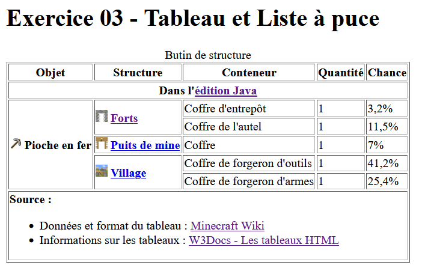
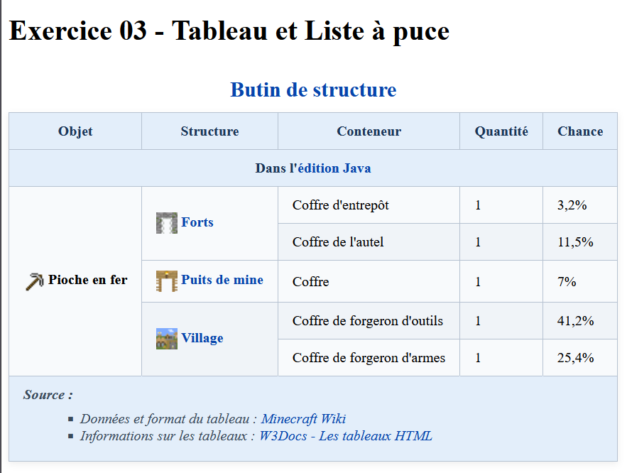

# Tableau et liste à puce

**Objectif**

- Créer un tableau structuré
- Fusionner des colonnes et des lignes
- Insérer des images et un liste à puce dans une cellule

## Initialisation de l'exercice

- Creez un répertoire nommé **ex03_tableau** dans votre répertoire **designweb**.
- Dans ce répertoire créez un répertoire **assets** et dans celui-ci un sous-répertoire **images** 
- Créez un répertoire **css** à la racine de votre projet
- Créez un fichier **index.html** à la racine du projet avec la structure de base d'une page web (Utilisez un extrait de code).
- Téléchargez les ressources de l'exercice : [ex03_ressources.zip](../ressources/ex03_ressources.zip)
- Copiez les images dans le répertoire **images** et le fichier css dans le répertoire **css**
- Nous allons utiliser le fichier css pour valider votre tableau

## Création du tableau

Nous allons créer un tableau qui résume certain endroit où on peut trouver une pioche en fer dans l'édition Java de Minecraft. Les données et l'inspiration du tableau proviennent de [Minecraft Wiki](https://fr.minecraft.wiki/w/Pioche#Butin_de_structure){target=_blank}

Voici en image le tableau que vous devez reproduire
<figure markdown>
  {.center .shadow}
</figure>

1. Le titre est de niveau 1
2. Structure du tableau : 
    - Utilisez la balise `<caption>` pour donner le titre *Butin de structure* au tableau
    - Les deux premières lignes du tableau sont dans l'entête du tableau
    - Les lignes "Pioche en fer" composent le corps du tableau
    - La cellule `Source` est dans le pied du tableau
3. Les textes **Pioche en fer**, **Forts**, **Puits de mine** et **Village** sont en caractère gras
4. Les images à utiliser sont dans les ressources à télécharger. Elles sont déjà de la bonne dimension.
5. Voici les url à utiliser pour les différents liens : 
    - `édition Java` : https://fr.minecraft.wiki/w/%C3%89dition_Java
    - `Forts` : https://fr.minecraft.wiki/w/Fort
    - `Puits de mine` : https://fr.minecraft.wiki/w/Puits_de_mine
    - `Village` : https://fr.minecraft.wiki/w/Village
    - `Minecraft Wiki` : https://fr.minecraft.wiki/w/Pioche#Butin_de_structure
    - `W3Docs - Les tableaux HTML` : https://fr.w3docs.com/apprendre-html/les-tableaux-html.html

## Validation du tableau

Une fois votre travail terminé et identique à l'image plus haut, ajoutez la ligne suivante dans la section `head` de votre page et rechargez là. (Assurez-vous d'avoir bien copié le fichier style.css dans le répertoire css)

```html
<link rel="stylesheet" href="./css/style.css">
```

Si vous avez bien suivi les consignes, votre tableau devrait maintenant ressembler à ceci
<figure markdown>
  {.center .shadow}
  <figcaption>Version finale avec CSS</figcaption>
</figure>