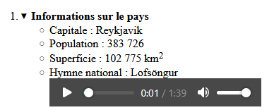
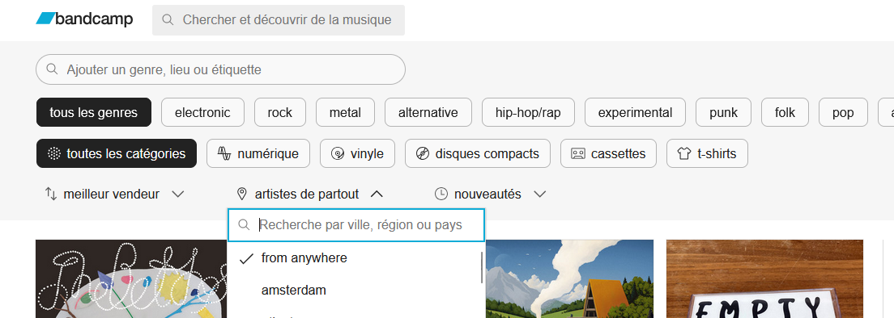
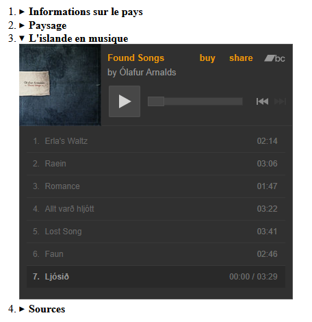
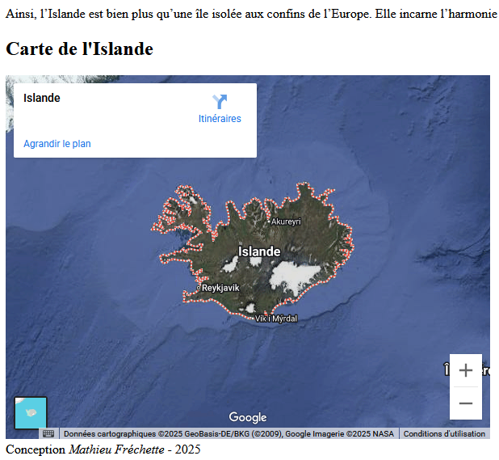

# Intégration multimedia

**Objectif**

- Intégrer de l'audio et une vidéo
- Intégrer un widget avec la balise `<iframe>`

## Initialisation de l'exercice

- Faites une copie de votre répertoire de l'exercice 02 et renommé le **ex04_multimedia**.
- Dans cet exercice nous allons ajouter des éléments multimedia à la page qu'on avait fait sur un pays du monde.

## Hymne national du pays

- Rendez-vous sur la page Wikipedia de votre pays.
- Téléchargez le fichier audio de l'hymne national.
- Dans la section **Information sur le pays**, ajoutez un quatrième item à la liste à puce.
- Inscrivez le texte `Hymne national : Nom de l'hymne` et sauter une ligne avec la balise ` `
- Ensuite, toujours dans le même item de liste, utilisez la balise `<audio>` pour ajouter votre fichier audio à la page

<figure markdown>
  {.center .shadow}
</figure>

## Intégration d'un iframe

Ici je vous offre deux choix : 

### Choix 1 - Intégrer une vidéo Youtube

- Ajoutez un nouveau *details* à la liste à puce numéroté entre **Paysage** et **Sources**. Le texte du *summary* est **Nom du pays en vidéo**.
- Trouvez une vidéo youtube dont le sujet est votre pays.
- Copiez le code *iframe* que Youtube vous propose dans le *details* que vous venez d'ajouter.

### Choix 2 - Intégrer un album bandcamp

- Ajoutez un nouveau *details* à la liste à puce numéroté entre **Paysage** et **Sources**. Le texte du *summary* est **Nom du pays en musique**
- Sur le site [Bandcamp](https://bandcamp.com/){target=_blank}, faites une recherche pour un artiste de votre pays : [Page de recherche]([https://bandcamp.com/discover){target=_blank}

<figure markdown>
  {.center .shadow}
  <figcaption>Recherchez le nom de votre pays en anglais</figcaption>
</figure>

- Sélectionnez ensuite un album qui vous plais et visitez sa page.
- Sous l'image de l'album, vous avez un lien **Partager/Intégrer**, cliquez ensuite sur **Intégrer cet album**.
- Choissisez le format de *widget* que vous préférez.
- Copiez le code *iframe* que Bandcamp vous propose dans le *details* que vous venez d'ajouter.

<figure markdown>
  {.center .shadow}
</figure>

## Intégrer une carte Google Maps

- Ajoutez une section entre la fin de votre texte et votre signature.
- Le titre de la section sera **Carte de nom du pays** de sera de niveau 2.
- Sur [Google Maps](https://www.google.ca/maps?hl=fr){target=_blank}, faites une recherche de votre pays.
- Cliquez sur **Partager** et **Intégrer une carte**.
- Choissisez le format de carte désiré et copiez le code *iframe* dans la section.

<figure markdown>
  {.center .shadow}
</figure>