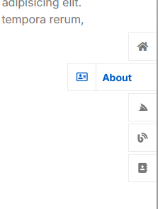

# Exercice 05 - Modification d'une maquette

**Objectif**

- Apprendre à lire et à comprendre du code HTML.
- Adapter un code existant en lui apportant des modifications sans dénaturer le résultat.

Dans cet exercice vous devez modifier les informations d'une maquette d'un site de portfolio. 

## Initialisation de l'exercice

- Téléchargez la maqette suivante et décompressez là dans votre répertoire **designweb** : 
[ex05_maquette.zip](../ressources/ex05_maquette.zip)
- Faites une copie du fichier **index.html** que vous nommerez **index_backup.html**.
- Vous pourrez y revenir si vos modifications brise la mise en page de la maquette originale. 
- Modifiez le titre de la page pour **Exercice 05 - Maquette** et ajoutez un favicon de votre choix.
- Effectuez les modifications demandées.

## Sections du site à masquer

- Le site est composé de 10 sections (*Home, About Me, Education, Experience, Skills, My Services, Portfolio, Blog, Testimonial, Contact Me*)
- Vous devez masquer les sections *Experience*, *My Services*, *Portfolio*, *Blog* et *Contact*.
- Pour masquer une section, mettez les lignes de codes qui la compose en commentaire, ==ne les supprimez pas==. (Vous pourriez en avoir besoin plus tard)

## Menu de navigation

- Il y a un menu de navigation entre les sections à droite de la page

<figure markdown>
  {.center .shadow}
</figure>

- Modifiez le pour que: 
    - Le troisième item doit pointer vers la section *Education* et non *Service*. Faites les modifications nécessaire.
    - Supprimez le 4e item (Blog)
    - Modifiez le 5e item pour qu'il pointe sur la section *Testimonial* et non *Contact*

## Traduction des textes

- Tous les textes de la page doivent être en français ou du Lorem Ipsum.
- Avant de traduire un texte, assurez-vous que je ne le vous fais pas supprimer.
- N'oubliez pas aussi de traduire les titres du menu de navigation.

## Modification par section

### Home

- Supprimer le titre **Pigra**
- Modifiez le texte dans la barre de gauche à votre goût.
- Modifiez aussi à gauche le texte "Junior UI/UX Designer Developer" à votre goût.
- Conservez le texte Lorem Ipsum
- Dans la liste de contact, masquez tout sauf l'adresse courriel et l'url de site. Modifiez les informations pour votre adresse **etudiant.cegepvicto.ca** et l'url de votre profil Github. 
- Masquez tous les boutons sociaux sauf celui de LinkedIn (vous pouvez laisser l'url **#** ou bien entrer celle de votre profil LinkedIn si vous en avez un).
- Modifiez le bouton de Facebook pour que l'url pointe vers votre profil Github. Changez aussi la classe de l'icône (balise `<i>`) pour cette valeur = `fab fa-github text-white`. Réaffichez ensuite ce bouton.
- Finalement modifiez la photo pour une photo de votre goût. Vous n'êtes pas obligé d'utiliser une photo de vous mais assurez vous que l'image conservera la mise en page.
- Copiez l'image au bon endroit dans la structure de la maquette.

### About Me

- Modifiez le texte dans la barre de gauche à votre goût.
- Modifiez aussi à gauche le titre.
- Conservez le texte Lorem Ipsum.
- Modifiez la photo à votre goût.
- Quand on survole la photo, une liste de boutons apparait. Faites la même modification que pour les boutons sociaux dans la section précédente (modifier Facebook pour Github et conserver LinkedIn) 
- Traduisez les titres *Phone, Nationality, Email, Address et Freelancer*. Vous pouvez inscrire ce que vous voulez dans cette section.
- Le bouton **Download My CV** doit permettre de lancer ==automatiquement== le téléchargement du fichier **READ-ME.txt** situé à la racine du projet. 
- Changez aussi le texte du bouton pour **Téléchargez mon CV**

### Education

- Modifiez le texte dans la barre de gauche à votre goût.
- Entrez au moins un diplôme que vous avez reçu.
- Masquez les mentions qui ne sont pas utilisées

### Skills

- Modifiez le texte dans la barre de gauche à votre goût.
- Conservez uniquement les habiletés JavaScript et HTML & CSS
- Inscrivez le score que vous voulez à ces deux habiletés

### Testimonial

- Modifiez le texte dans la barre de gauche à votre goût.
- Ajoutez un nouveau témoignage.
- L'image à utiliser est **testimonial-img-4.jpg** et est disponible dans le dossier **img**
- Le nom de la personne est `Samantha Bell` et elle habite à `Exeter, United Kingdom`
- Samantha n'a pas trop aimé votre travail et n'affichez que 3 étoiles à son commentaire. 

## Pied de page

- Masquez les boutons de médias sociaux
- Modifiez le texte **Your site Name** par votre nom et enlevez le lien hypertexte.
- Conservez le texte **Designed By HTML Codex**

