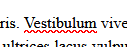
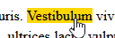
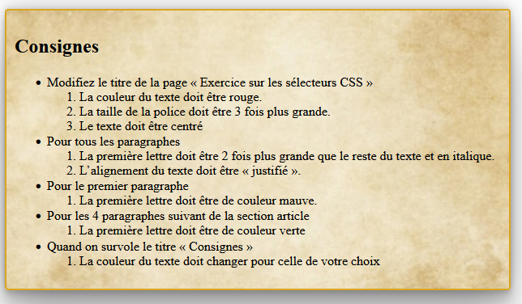
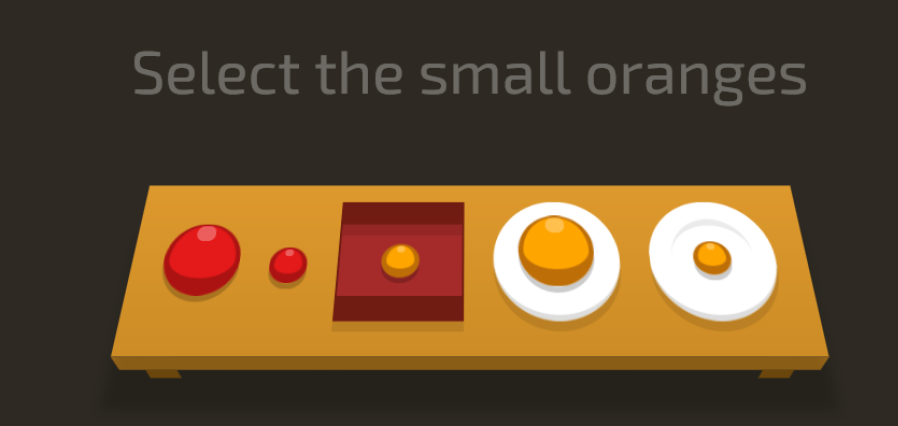

# Exercice 06 - Les sélecteurs CSS

## Mise en place de l'exercice

- Téléchargez le projet de départ dans le devoir Teams et copiez-le dans votre répertoire **designweb**
- Créez ensuite un dossier nommé **css** et dans ce dossier un fichier **style.css** où vous allez écrire votre code css.
- Reliez votre fichier css au fichier **index.html**
- Une fois le travail terminé, compressez votre dossier et remettez le sur Teams.

## Consignes

!!! Note 

    Vous devez faire cette exercice uniquement avec des règles css. Il y a plusieurs solutions possibles pour les sélecteurs à utiliser, à vous de décider. Peut-être que vous devrez rechercher des solutions sur internet.

1. Modifiez le titre de la page « Exercice sur les sélecteurs CSS »
    - La couleur du texte doit être rouge.
    - La taille de la police doit être 3 fois plus grande. (utilisez l'unité de mesure {==em==})
    - Le texte doit être centré
2. Pour tous les paragraphes
    - La première lettre doit être 2 fois plus grande que le reste du texte et en italique.
    - L’alignement du texte doit être « justifié ».
3. Pour le premier paragraphe
    - La première lettre doit être de couleur mauve.
4. Pour les 4 paragraphes suivant de la section article
    - La première lettre doit être de couleur verte
5. Quand on survole le titre « Consignes »
    - La couleur du texte doit changer pour celle de votre choix

!!! Attention

    Pour les prochaines consignes, vous allez devoir rechecher par vous-même les propriétés à utiliser. C'est impossible de toutes les retenir par coeur et vous devez apprendre à faire vos propres recherche pour trouver l'information. 
    
    Assurez vous aussi de **bien comprendre les solutions** que vous mettez en place.

### Stylisez un lien

Sélectionnez un mot dans un des paragraphes et transformez le en lien hypertexte, à vous de choisir vers quelle page pointe le lien. Modifiez le style du lien selon les points suivants : 

1. Le texte doit être de la même couleur que le texte du paragraphe (par défaut la couleur est bleu). Si on change la couleur du texte du paragraphe, le lien aura lui aussi la même couleur.
2. Changez la barre de soulignement pour une barre ondulée et de couleur rouge.
3. Quand on survole le lien, la barre de soulignement doit disparaitre complêtement et le fond du texte doit être jaune, comme s'il était surligné.

    {.shadow}
    {.shadow}

### Mise en forme du bloc des consignes

Transformez le bloc où sont inscrit les consignes de la façon suivante : 

1. Ajoutez une bordure de 2 pixels de couleur #daa520.
2. Les coins de la bordure sont arrondis.
3. Le bloc doit avoir une largeur de 600 pixels.
4. Ajoutez aussi un espacement interne de 10 pixels sur les 4 côtés.
5. Il y a une image de fond, utilisez celle-ci : [ex06_image_fond.jpg](../images/ex06_image_fond.jpg){target=_blank}.
6. L'image doit être étiré pour quelle occupe toute la largeur du bloc.
7. Pour la touche finale ajoutez une ombre autour du bloc.

Le résultat devrait ressembler à ceci

### CSS Diner

- Créer un fichier texte à la racine de votre projet intitulé **css-diner-solution.txt**
- Réalisez les exercices à l'adresse suivante et inscrivez les solutions dans le fichier texte. 
- CSS Diner : [https://flukeout.github.io/](https://flukeout.github.io/){target=_blank}

- Essayez de réussir les 32 niveaux, on regarde ça ensemble au prochain cours.
- Prenez le temps de lire les explications (en anglais) dans le menu de droite, elles vous expliquent souvent le sélecteur à utiliser.