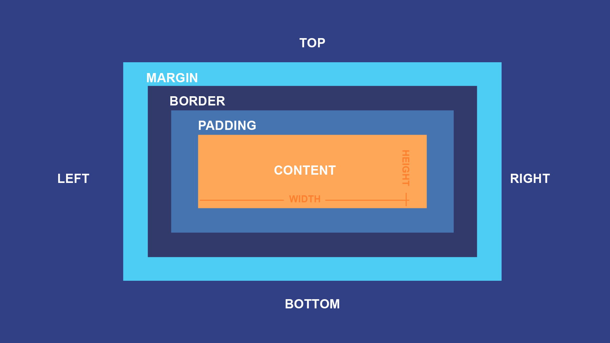

# Le modèle de boite

En css chaque élément est disposé sous forme de boite, c'est ce qu'on appele le "*box model*". Une boîte comporte quatre propriété qui vont définir son apparence dans le navigateur : 

- `content` : La zone où le contenu est affiché, qu'on peut ajuster avec `width` et `height`.
- `padding` : Un espacement situé à l'intérieur de la boite. On utilise `padding` pour dimensionner cet espacement.
- `border` : La bordure de la boite. On peut ajuster son épaisseur, sa couleur, etc..
- `margin` : Un espacement situé à l'extérieur de la boîte. On utilise `margin` pour dimensionner cet espacement.

Les propriétés sont résumées dans cette image 

<figure markdown>
  {.center .shadow}
</figure>

## Propriétés pour ajuster les espacements

La marge : `margin`
```css
p {
  /* margin-coté pour ajuster qu'un côté à la fois */
  margin-top: 100px;
  margin-bottom: 100px;
  margin-right: 150px;
  margin-left: 80px;

  /* Raccourci sur une ligne (top right bottom left) */
  margin: 25px 50px 75px 100px;

  /* Raccourci deux côtés (top,bottom ensemble et left, right ensemble*/
  margin: 25px 50px;

  /* Tous les côtés égaux */
  margin: 50px;
}
```

Le padding : `padding`
```css
p {
  /* Tous les côtés égaux à 50px*/
  padding: 50px;

  /* On peut aussi faire toutes les déclinaisons vues avec margin */
}
```

La bordure : `border`
```css
p {
  border-width: 1px;
  border-style: solid;
  border-color: rgb(0, 0, 0);
  /* Raccourci en une ligne */
  border: 1px solid rgb(0, 0, 0);
}
``` 


## Deux modèles de boîtes

Quand on défini une largeur et une hauteur à notre boîte, les dimensions sont en fait appliqué à la zone de contenu (content). Si on veut calculer l'espace réel que prendra la boîte, on doit additionner le contenu, le padding et la bordure. Prenons par exemple le code suivant : 

```css
.maboite {
    width : 100px;
    padding: 10px;
    border: 1px solide purple;
}
```

La dimension réel sera 122px, 100 en largeur + 10 de padding gauche + 10 de padding droite + 1 de bordure gauche + 1 de bordure droite.

On peut modifier se comportement avec la propriété css `box-sizing`. En lui donnant la valeur **border-box** au lieu du défaut **content-box** le calcul se fera différamment. La largeur donnée représentera la <u>largeur total</u> de la boite, c'est-à-dire le contenu + le padding + la bordure. Donc si on reprend l'exemple plus haut en modifiant le `box-sizing` : 

```css hl_lines="2"
.maboite {
    box-sizing: border-box;
    width : 100px;
    padding: 10px;
    border: 1px solide purple;
}
```

La dimension de la boite sera de 100px comme défini par la propriété `width`. Par contre le contenu aura une largeur de 78px (la largeur - le padding - la bordure).

Plusieurs développeurs trouvent plus simple de travailler avec la deuxième méthode. Si on veut l'appliquer à tout notre document, on peut ajouter les règles suivantes en début de notre fichier css.

```css
html {
  box-sizing: border-box;
}
*,
*::before,
*::after {
  box-sizing: inherit;
}
```


## Block vs Inline

Les éléments HTML ne sont pas tous affiché de la même façon par le navigateur. Il y a plusieurs dispositions possibles, dont **block** et **inline**. Chaque élément html est disposé par défaut selon un de ces deux modes.

### Block

Avec un élément ayant la disposé en **block** : 

- On provoque un saut de ligne.
- On peut lui spécifier une hauteur (**height**) et une largeur (**width**)
- Si aucune largeur n'est donnée, l'élément prendra toute la largeur disponible.

Exemple de balise : **div**, **p**, **h1** à **h6**

### Inline

Avec **Inline**,  l'élément 

- Est disposé à la suite des autres sans commencer une nouvelle ligne. 
- Ne peut recevoir de hauteur ou de largeur (à part la balise **img** mais c'est un cas particulier).
- Ignore le *padding* et la marge en haut et en bas.

Exemple de balise : **a**, **span**.

On peut modifier la dispositon d'un élément en css avec la propriété `display` et les valeurs `block` et `inline` : 

```css
/* Toutes les balises span vont être disposé en bloc */
span {
    display: block;
}
```


## Sources

- [https://developer.mozilla.org/fr/docs/Learn/CSS/Building_blocks/The_box_model](https://developer.mozilla.org/fr/docs/Learn/CSS/Building_blocks/The_box_model){:target="_blank"}
- [https://edu.gcfglobal.org/en/basic-css/the-css-box-model/1/#](https://edu.gcfglobal.org/en/basic-css/the-css-box-model/1/#){:target="_blank"}