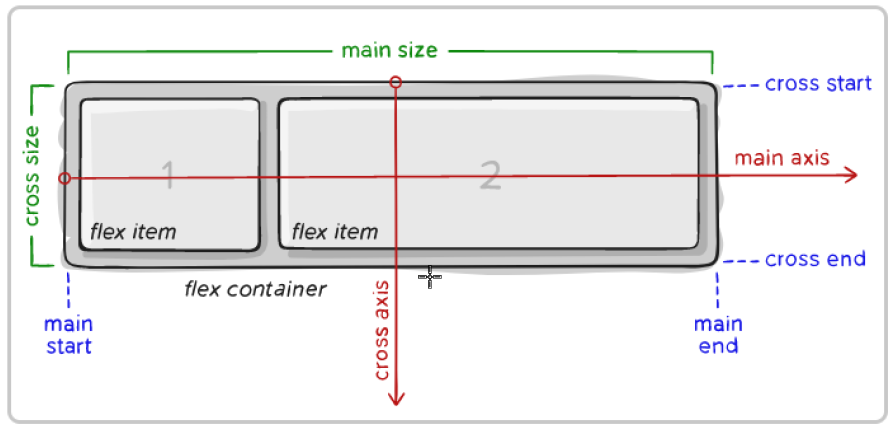
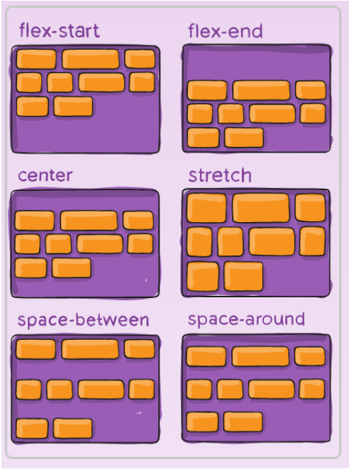
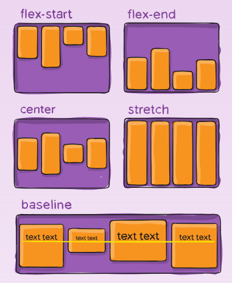
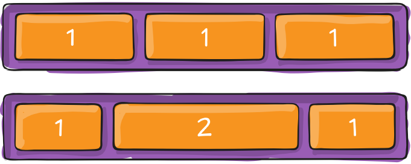
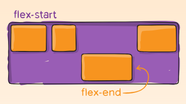

# Flexbox

Le *Flexible Box Layout* (ou Flexbox) est un module CSS qui permet de créer des mises en page simples et flexibles.

Il est conçu pour distribuer l’espace et aligner des éléments dans un conteneur, même quand la taille de ce conteneur ou de ses enfants est inconnue ou variable.Le conteneur à le pouvoir de redimensionner ses items enfants selon l'espace disponible.

Flexbox est donc une méthode efficace pour créer des pages web "responsive", qui s'adaptent au différent support avec laquelle on la consulte. 

Nous allons l'utiliser principalement pour la mise en page de petite section de nos site, un menu, une section de titre, etc. Pour des mises en page plus globale et rigide, il y a d'autres méthodes plus appropriées comme **Grid** que nous verrons ultérieurement.

## Définition

L'idée générale de Flexbox est qu'on englobe le contenu avec lequel on veut travailler dans un conteneur. N'importe quelle élément HTML (balise) peut faire office de conteneur, mais certains sont plus approprié que d'autres. Les éléments qui se retrouvent dans le conteneur, les items, seront affecté par les propriétés du conteneur et aussi par des règles propres à eux. 

!!! Attention 

	Seulement les enfants immédiats du conteneur parent sont affectés. 
		
Voici un schéma qui résume la disposition des éléments : 

<figure markdown>
  {.center .shadow}
  <figcaption></figcaption>
</figure>


## Les propriétés du conteneur

### display

Pour déterminer que l'élément est un conteneur flexbox. Cette propriété va nous permettre d'utiliser les autres propriétés flexbox sur cet élément et tous ses enfants.

``````css
.container_titre {
	display: flex;
}
``````

### flex-direction

C'est avec cette propriété qu'on va définir le sens de distribution des items. Les valeurs possibles sont : 

- `row`: **par défaut**, en ligne de gauche à droite
- `row-reverse` : en ligne, de droite à gauche
- `column` : en colonne, de haut en bas 
- `column` : en colonne, de bas en haut

### justify-content

**justify-content** permet de définir l'alignement des items suivant le **main-axis**.

- `flex-start` : par défaut, les items sont alignés au début selon le sens de **flex-direction**.
- `flex-end` : Les items sont aligné à la fin selon le sens de **flex-direction**
- `center` : Les items sont centrés
- `space-between` : Le premier et dernier items sont alignés respectivement au début et à la fin, les autres items sont distribués de façon égale sur la ligne.
- `space-around` : Les items sont distribué uniformément le long de l'axe et un espace égale au début et à la fin.
- `space-evenly` : Les items sont distribuéé pour que l'espace entre chaque soit la même.

<figure markdown>
  {.center .shadow}
  <figcaption><a href="https://css-tricks.com/snippets/css/a-guide-to-flexbox/#aa-justify-content" target="_blank">CSS-Tricks - justify-content</a></figcaption>
</figure>

### align-items

Détermine comment les items seront alignés selon l'axe secondaire (cross axis).

- `stretch` : par défaut, les items seront étirés pour remplir l'espace disponible dans le conteneur
- `flex-start` : les items sont alignés au début de l'axe secondaire
- `flex-end` : les items sont alignés à la fin de l'axe secondaire
- `center` : les items sont centrés selon l'axe secondaire

<figure markdown>
  {.center .shadow}
  <figcaption><a href="https://css-tricks.com/snippets/css/a-guide-to-flexbox/#aa-align-items" target="_blank">CSS-Tricks - align-items</a></figcaption>
</figure>

### align-content

Cette propriété est effective ==seulement quand il y a plusieurs lignes d'items dans le conteneur==. C'est un peu le même principe que pour la propriété justify-content mais au niveau de l'axe secondaire (cross axis). Les valeurs possibles sont les suivantes: 

<figure markdown>
  {.center .shadow}
  <figcaption><a href="https://css-tricks.com/snippets/css/a-guide-to-flexbox/#aa-align-content" target="_blank">CSS-Tricks - align-content</a></figcaption>
</figure>

### flex-wrap

Les items vont par défaut essayer de tenir sur la même ligne. On peut changer ce comportement et permettre au items de pouvoir se disposer sur une autre ligne quand c'est nécessaire et possible.

### flex-flow

La propriété **flex-flow** est un raccourci pour définir les propriétés **flex-direction** et **flew-wrap** dans une seule ligne.

``````css
/* Au lieu d'écrire ceci */
flex-direction: row-reverse;
flex-wrap: wrap;
/* on peut résumé par cette ligne */
flex-flow: row-reverse wrap;
``````

## Les propriétés des items

### flex-grow

Définie la capacité pour un item de s'agrandir quand c'est nécessaire. La propriété indique quel quantité d'espace "restant" du conteneur l'item peut utiliser pour s'agrandir. La valeur de la propriété est un entier positif sans unité de mesure qui représente une proportion. Si j'ai par exemple trois items et que je leur défini la propriété flex-grow à 1, les trois items auront la même dimension. Par contre si un des items à une valeur de 2 et les autres 1, le premier item sera 2 fois plus grand que les deux autres.

<figure markdown>
  {.center .shadow}
  <figcaption><a href="https://css-tricks.com/snippets/css/a-guide-to-flexbox/#aa-flex-grow" target="_blank">CSS-Tricks - flex-grow</a></figcaption>
</figure>


### flex-shrink

Quand la taille de tous les items ==est plus grande que leur conteneur==, les items peuvent retrécir pour qu'ils soient ajustés au conteneur. Le facteur de rétrécissement est indiqué par la valeur de la propriété `flex-shrink`. Par défaut la valeur est 1 et une valeur de 0 indique que la taille de l'item ne peut être diminuée.  

### flex-basis

Détermine la taille par défaut d'un élément avant que l'espace disponible ne soit distribué.

### flex

C'est un raccourci pour les propriétés **flex-grow**, **flex-shrink** et **flex-basis**. Ces deux derniers sont optionnel, on peut spécifié uniquement une valeur pour **flex-grow**.

``````css
flex: 2 1 25%
/* est équivalent à */
flex-grow: 2;
flex-shrink: 1;
flex-basis: 25%;
``````

### align-self

Permet d'outrepasser l'alignement par défaut pour un item. Les valeurs possible sont les mêmes que pour align-items.

<figure markdown>
  {.center .shadow}
  <figcaption><a href="https://css-tricks.com/snippets/css/a-guide-to-flexbox/#align-self" target="_blank">CSS-Tricks - align-self</a></figcaption>
</figure>

## Tutoriel sous forme de jeux

- [Flexbox Froggy](https://codepip.com/games/flexbox-froggy/){:target="_blank"}
- [Flexbox Zombies](https://mastery.games/flexboxzombies/){:target="_blank"}

## Sources et références

- [MDN - Les concepts de base pour flexbox](https://developer.mozilla.org/fr/docs/Web/CSS/CSS_Flexible_Box_Layout/Basic_Concepts_of_Flexbox){target=_blank}
- [W3Docs - Le guide ultime de Flexbox](https://fr.w3docs.com/apprendre-css/the-ultimate-guide-to-flexbox.html){target=_blank}
- [CSS Tricks - CSS Flexbox Layout Guide ](https://css-tricks.com/snippets/css/a-guide-to-flexbox/){target=_blank}
- [Digging Into the Flex Property](https://ishadeed.com/article/css-flex-property/){target=_blank}
- [Flexbox -CheatSheet](https://yoksel.github.io/flex-cheatsheet/){target=_blank}


