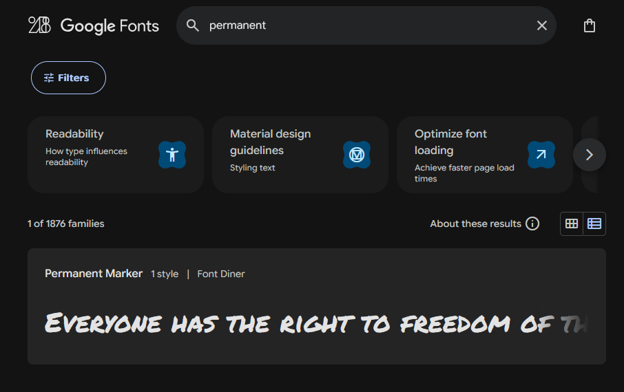
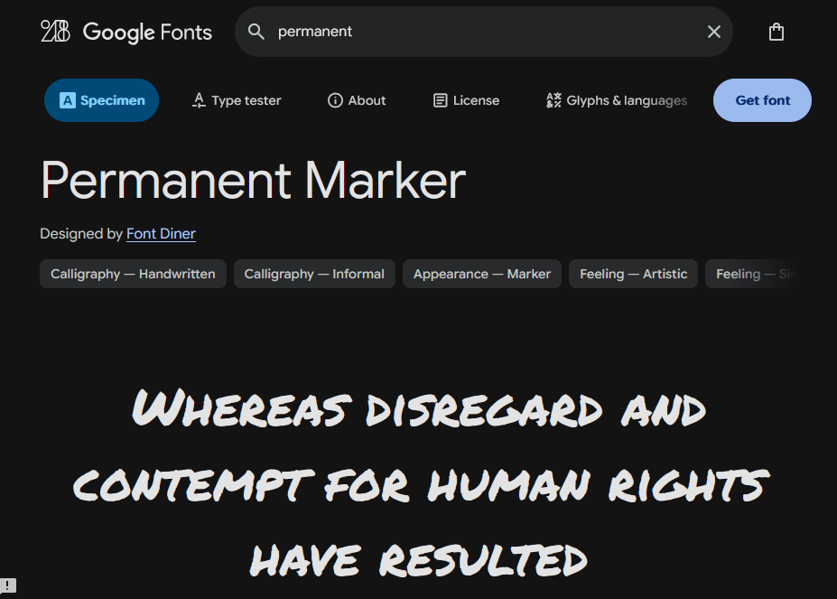
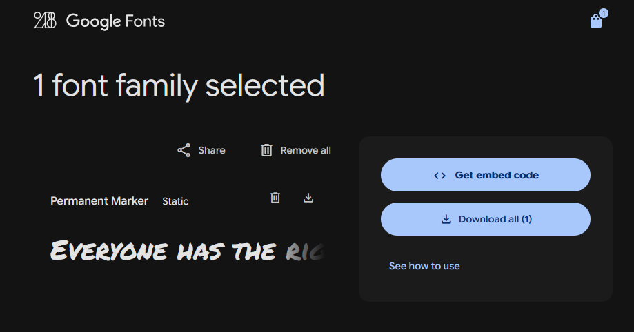
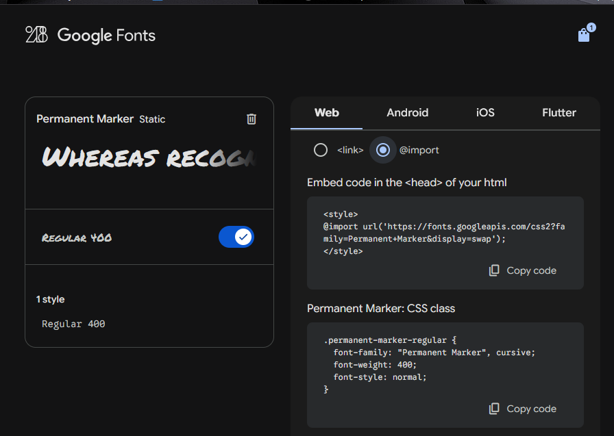
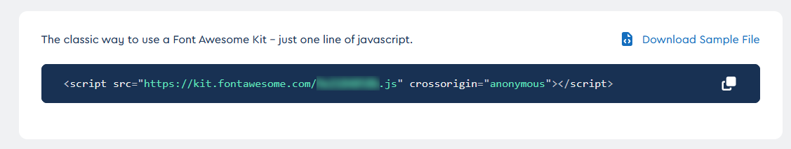
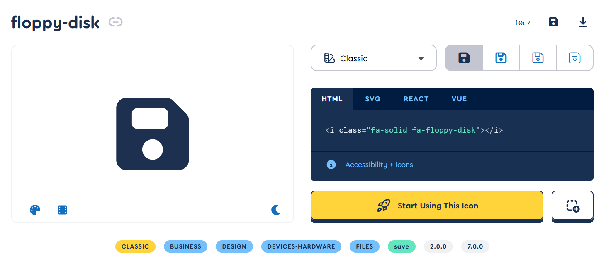

# Utiliser des polices de caractères personnalisées

Pour pouvoir afficher du texte avec une police de caractères précise dans une page internet, cette police doit être présente sur l'ordinateur de l'usager. Il existe une liste de polices de caractère qui sont présentent sur pratiquement toutes les systèmes d'opérations et qu'on peut utiliser sans risque. (Le bon vieux Time New Roman par exemple) Vous pouvez consulter cette liste [ici](https://developer.mozilla.org/en-US/docs/Learn/CSS/Styling_text/Fundamentals#web_safe_fonts){target=_blank}.

Cependant on veut pouvoir sortir de ce cadre et avoir accès à une multitude de style d'écriture différent. Il existe des façons de faire et on va en voir deux.

## Les Web Fonts

La première option, ==et celle qui est à prévilégier==, est d'inclure le fichier de la police que l'on veut utiliser dans les fichiers de notre site et d'ensuite faire une lien avec celui-ci dans nos feuilles de style qui vont l'utiliser.

On va commencer par utiliser la commande **@font-face** pour relier un mot-clé au fichier de la police. On va faire cette déclaration au début de notre fichier CSS.

``````css
@font-face {
	font-family: "nomDeLaPolice"; /* Le nom de la police qu'on va utiliser plus loin */
	src: url("monFichier.ttf"); /* Le lien vers le fichier de la police */
}
``````

Ensuite avec la propriété **font-family**, on va utiliser le mot-clé qu'on vient de définir. **Font-family** peut prendre plusieurs noms de police en valeur, chacune séparé par une virgule. Si la première valeur n'est pas trouvé, on passe à la seconde et ainsi de suite. Si aucune valeur n'est trouvé le navigateur va utiliser la police par défaut du système.

``````css
h1 {
	font-family: "nomDeLaPolice", "Time New Roman"
    /* Ici toutes les balises h1 vont utiliser la police qu'on a défini plus haut. Si le 
       fichier n'est pas trouvé, elle vont utiliser Time New Roman */
}
``````

Exemple 

``````css
@font-face {
    font-family: "cyberpunk";
    src: url("../assets/Cyberpunk.ttf");
}

h1 {
    font-family: "cyberpunk";
}
``````

Pour aller plus loin : [https://developer.mozilla.org/en-US/docs/Learn/CSS/Styling_text/Web_fonts](https://developer.mozilla.org/en-US/docs/Learn/CSS/Styling_text/Web_fonts){target=_blank}

!!! Astuce "Où trouver des fonts gratuites?"

    - [www.dafont.com](https://www.dafont.com/fr/){target=_blank}
    - [Google Font](https://fonts.google.com/){target=_blank} (Vous pouvez télécharger les fichiers de font)

## Google font

Une deuxième option est d'utilisé des services de ressources en ligne comme Google Font. L'avantage est qu'on n'est pas obligé d'inclure les fichiers à notre site internet, on va les chercher directement en ligne. Le désavantage est que l'affichage de la page internet est qu'on est dépendant du service, si il devient inaccessible notre ressource le sera aussi.

??? note "Voici un exemple d'utilisation avec Google Font"

    Une fois sur [Google Font](https://fonts.google.com/){target=_blank}, on recherche la police qui nous convient. 

    {.center .shadow}

    Ensuite on a parfois à choisir des options et on clique sur l'icone **Get font** en haut à droite.

    {.center .shadow}

    On peut ensuite choisir de télécharger le fichier (**Download all**) ou de récupérer le code pour l'insérer dans notre css.

    {.center .shadow}

    On nous donne le code à ajouter dans notre projet pour utiliser la police. On peut le faire avec la balise **link** depuis le fichier HTML ou bien avec **@import** dans le fichier CSS. Ensuite on va utiliser **font-family** comme avec les **web-fonts**.

    {.center .shadow}

    Si on a décidé de télécharger le fichier de police, on utilisera ensuite la même technique que pour les **web-fonts**.

Un exemple du résultat, uniquement en css

``````css
@import url('https://fonts.googleapis.com/css2?family=Press+Start+2P&display=swap');

html {
	font-family: 'Press Start 2P', cursive;
}
``````

## Font Awesome

Un autre service qui pourrait être intéressant pour vos projet est [font awesome](https://fontawesome.com/){target=_blank}. Il nous offre une sélection de milliers d'icônes à utiliser gratuitement. Pratique quand vous voulez utiliser plusieurs icônes pour votre site. 

??? note "Comment ajouter des icones de Font Awesome"

    - Vous devez en premier lieu vous inscrire sur le site avec une adresse courriel. 
    - Une fois la procédure d'inscription terminée, vous pourrez créer votre premier "kit". 
    - Sélectionnez tout les styles gratuits et cliquez sur **Next**.
    - Laissez Fontawesome se charger de l'hébergement (**Hosted by Us**).
    - Ensuite vous pouvez personalisez votre kit et une fois terminé cliquez sur **Make My Kit**.
    - Finalement on vous donnera une ligne de code que vous devrez copier dans chaque page html où vous voulez utiliser les icônes.
    - Le code doit être ajouter dans la section `\<head\>` de votre page


    {.center .shadow}

    Ensuite vous pouvez faire une recherche dans la banque d'icône, pensez à cocher la case "free" pour n'avoir que les icônes gratuit. Une fois l'icône de vos rêves trouvé, on vous donne un code html sous la forme d'une balise **i** à ajouter à votre fichier HTML.

    

    


``````html title="Exemple d'utilisation"
<!DOCTYPE html>
<html>
    <head>
        <meta charset="utf-8">
        <title>Exemple Font-Awesome</title>
        <!-- Le CDN de mon kit Font Awesome -->
        <script defer src="https://kit.fontawesome.com/8xxxxxx1.js" crossorigin="anonymous"></script>
    </head>

    <body>
        <button><i class="fa-solid fa-floppy-disk"></i></button>
    </body>
</html>
``````


