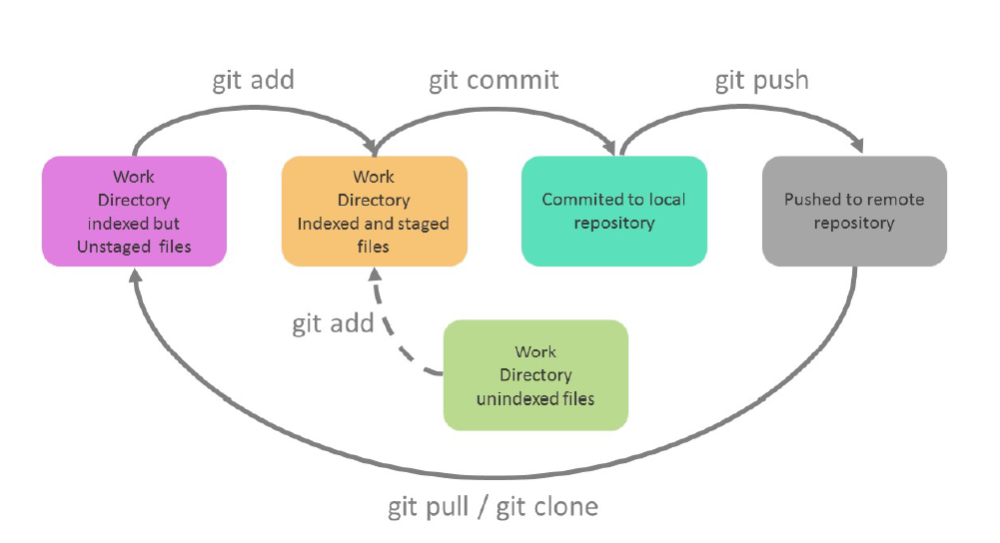
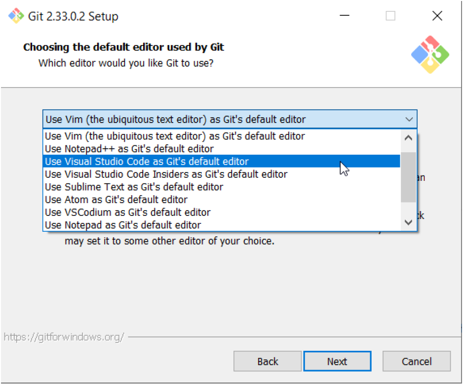
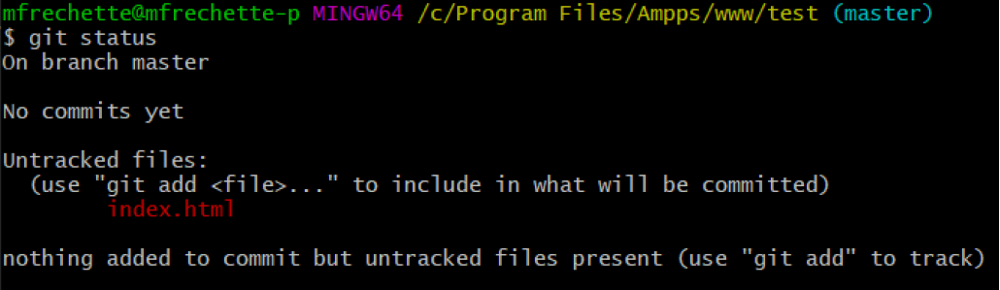
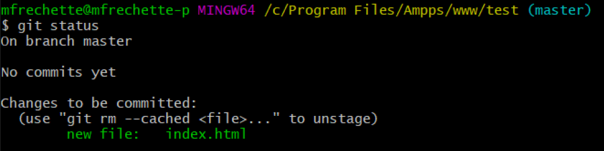

# Le versionnage de fichiers avec GIT

Git est un logiciel de gestion de version. Son rôle est de suivre les modifications faites dans les fichiers appartenant aux projets qu'il "suit" et de permettre de créer et d'organiser plusieurs version de ces projets. On peut utiliser Git en "local", depuis une installation sur un autre ordinateur ou bien sur un serveur distant. Attention Git n'est pas à confondre avec GitHub, qui est un site internet qui offre l'accès à un serveur GIT distant. 

## Cycle de vie

<figure markdown>
  {.center .shadow}
</figure>

Le cycle de vie d'un fichier avec Git est le suivant : on travaille sur le fichier dans un répertoire qui contient un dépôt Git. Une fois les modifications terminées, on indique à Git d'ajouter le fichier dans la file d'attente du prochain commit avec la commande **git add**. Quand on est prêt à officialiser les changements, on créer un commit avec la commande **git commit**. Ensuite on peut aussi envoyer le commit à un serveur distant avec la commande **git push**. Les changements sont maintenant inclus dans une nouvelle version et on recommence le cycle.

## Installation de GIT

Pour installer Git sur un poste de travail, on doit le télécharger à l'adresse suivante

[https://git-scm.com/](https://git-scm.com/){target=_blank}

Vous pouvez conserver tous les paramètres par défaut, sauf peut-être le choix de l'éditeur de texte pour les messages de commit. Au lieu de VIM, sélectionnez l'éditeur que vous utilisez pour le développement de vos projet. (Vscode par exemple)

<figure markdown>
  {.center .shadow}
</figure>


 Après l'installation vous aurez accès à une console Git ( Git Bash ) et une interface graphique ( Git GUI ). La méthode la plus simple d'utiliser ces deux applications est d'ouvrir l'explorateur de fichiers et de vous diriger dans le répertoire où vous vous les utiliser ( habituellement le répertoire de votre projet ), de cliquer sur le bouton droit de la souris et de choisir dans le menu soit **Git Bash Here** ou **Git GUI Here**. Sachez qu'on peut faire sensiblement la même chose avec les deux programmes c'est une question de préférences. Les explications qui suivent seront données avec Git Bash.

## Initialiser un dépôt

La première chose à faire quand on veut utiliser Git sur un projet est d'initialiser un dépôt dans le répertoire de ce projet. Pour ce faire, ouvrez Git Bash et dirigez vous à la racine de votre projet. Entrez ensuite la commande suivante

```bash
git init
```
Vous aurez le message "*Initialized empty Git repository* " qui vous indiquera que l'initialisation a réussi. Un répertoire nommé **.git** sera aussi créé dans le répertoire où vous avez lancé la commande. Dans ce répertoire on retrouve des fichiers utilisés par Git, <u>il ne faut pas le supprimé</u>. À partir de maintenant vous pouvez utiliser Git pour suivre votre projet.

## Vérifier le statut d'un dépôt

Avec la commande **git status** on peut voir l'état des fichiers d'un dépôt

```bash
git status
```
<figure markdown>
  {.center .shadow}
</figure>


On retrouve plusieurs informations dans le résultat. On peut voir qu'aucun commit n'a encore été fait. Dans la section Untracked files on retrouve le fichier index.html, ce qui veux dire que ce fichier est présent dans le projet mais que Git ne suit pas ces modifications.

## Ajouter des fichiers dans le suivi de Git

On doit indiquer à Git quels fichiers il doit ajouter dans le prochain commit. Pour se faire on va utiliser la commande git add suivi du ou des noms de fichiers à suivre : 

```bash
git add index.html page2.html
```
On peut utiliser le point au lieu des noms de fichiers pour ajouter tout les fichiers du répertoire qui ne sont pas encore suivi.

```bash
git add .
```

Maintenant si on refait la commande git status en reprenant le projet plus haut, on aura le résultat suivant : 

<figure markdown>
  {.center .shadow}
</figure>

On peut voir que le fichier index.html est maintenant dans la "file d'attente" du prochain commit. Si on veut enlever un fichier de cette liste, on peut utiliser la commande 

```bash
git rm --cached index.html
```

Vous êtes maintenant prêt à créer un commit

## Créer un commit

Pour finaliser et officialiser les changements aux fichiers modifiés, on va créer un "commit" avec la commande git commit. Il est très important d'ajouter un message explicit de la raison du commit.

```bash
git commit -m "Message court mais explicite de la raison du commit"
```

## Pousser le commit vers un dépôt distant (Optionnel)

Si votre dépôt local est associé à un dépôt distant (sur Github par exemple), vous devez aussi faire une dernière commande pour envoyer le commit.

La première fois que vous lancez la commande, vous devez ajouter l'option -u suivi de "origin" et de "main" qui est le nom de la branche de votre commit.

``````bash
git push -u origin main
``````

Les fois suivantes vous pouvez uniquement faire git push

``````bash
git push
``````

## Résumé des commandes principales

Une fois votre dépôt bien configuré, quand vous avez des changements à appliquer, vous n'avez qu'à faire les trois commandes suivantes : 

``````bash
git add .
git commit -m "Nom du commit"
git push
``````