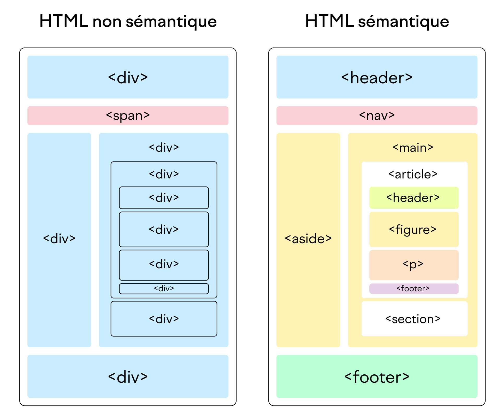

# Les balises sémantiques

Une balise sémantique en HTML est une balise qui donne un sens explicite au contenu qu’elle entoure. Contrairement aux balises purement structurelles ou de présentation (comme `
` ou ``), les balises sémantiques indiquent le rôle et la signification du contenu pour les navigateurs, les moteurs de recherche et les technologies d’assistance.

<figure markdown>
  {.center .shadow}
  <figcaption>Image 1. Découpage classique vs sémantique</figcaption>
</figure>

## Pourquoi est-ce important de les utiliser ?

1. Accessibilité
    - Les lecteurs d’écran et autres technologies d’assistance comprennent mieux la structure du document.
    - Facilite la navigation pour les personnes en situation de handicap.
2. Référencement naturel (SEO)
    - Les moteurs de recherche analysent la sémantique pour mieux indexer et classer le contenu.
3. Maintenance et lisibilité du code
    - Un code sémantique est plus clair et plus facile à maintenir pour les développeurs.
    - Permet de comprendre rapidement le rôle de chaque section sans devoir analyser tout le CSS.
4. Interopérabilité et normes du web
    - Favorise la compatibilité avec les navigateurs actuels et futurs.
    - Contribue à des standards web plus cohérents et durables.

## Balises sémantiques les plus utilisées

| Balise        | Rôle / Usage principal                                                                 |
|---------------|----------------------------------------------------------------------------------------|
| `<header>`    | Contient l'en-tête d'une page ou d'une section (logo, titre, menu).                    |
| `<nav>`       | Représente une zone de navigation (menu principal, sommaire).                          |
| `<main>`      | Définit le contenu principal de la page (unique par page).                             |
| `<section>`   | Regroupe un ensemble de contenus sur un même thème ou sujet.                          |
| `<article>`   | Contenu autonome et indépendant (article, fiche produit, post de blog).               |
| `<aside>`     | Contenu complémentaire ou annexe (barre latérale, encadré d'information).             |
| `<footer>`    | Pied de page d'une page ou d'une section (mentions légales, liens secondaires).        |
| `<h1>–<h6>`   | Titres et sous-titres structurés hiérarchiquement.                                     |
| `<figure>`    | Conteneur pour une image, un diagramme ou une illustration avec `<figcaption>`.        |
| `<figcaption>`| Légende décrivant l'élément `<figure>`.                                               |
| `<time>`      | Représente une date ou une heure, interprétable par les machines (format normalisé).   |
| `<mark>`      | Met en évidence une portion de texte pour souligner son importance.                    |
| `<address>`   | Fournit des informations de contact (email, adresse, téléphone).                       |

## Sources

- [https://developer.mozilla.org/fr/docs/Glossary/Semantics](https://developer.mozilla.org/fr/docs/Glossary/Semantics){target=_blank}
- [https://www.w3schools.com/html/html5_semantic_elements.asp](https://www.w3schools.com/html/html5_semantic_elements.asp){target=_blank}
- [https://fr.w3docs.com/apprendre-html/les-elements-semantiques-html5.html](https://fr.w3docs.com/apprendre-html/les-elements-semantiques-html5.html){target=_blank}

### Images

1. [https://fr.semrush.com/blog/balises-structurelles-html-semantique/](https://fr.semrush.com/blog/balises-structurelles-html-semantique/){target=_blank}

