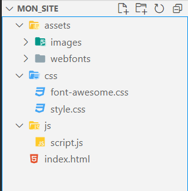

# Structure des fichiers d'un site internet

Un site internet va être composé de plusieurs fichiers différents: des fichiers html, des scripts, des images, des feuilles de styles css. Selon les architecture et les librairies qu'on utilise, il n'est pas rare qu'un site internet comporte des milliers de fichiers. Il est donc très important de se donner une bonne structure pour nous aider à nous y retrouver facilement. 

## Comment organiser mes fichiers

On va se créer un répertoire principal qui va contenir tous les fichiers de notre site internet, appelons le par exemple **mon_site**. Directement dans se répertoire on va y créer les fichiers html dont un qui se nommera index.html et qui sera la porte d'entrée de notre site. On dira que c'est fichiers sont à la racine du projet, ils sont au niveau le plus bas du répertoire de base. 

Ensuite on va créer un sous-répertoire **assets**. Dans ce répertoire on va stocker toutes les images, polices de caractères, vidéos, etc. Une bonne pratique est de créer dans assets des sous-répertoires pour chacune des catégories de ressources (les images par exemple). Ensuite, on va stocker les feuilles de styles et les scripts Javascript dans des sous-répertoires séparées créés à la racine du projet. Au final on aura une structure qui ressemble à ceci: 

<figure markdown>
  {.center .shadow}
</figure>

Vous êtes libres d'adapter cette structure selon vos goûts et besoins. L'important est d'avoir un fichier index.html à la racine du site et de bien séparer les différentes ressources.

