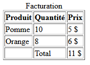
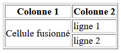
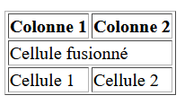
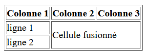

# Les tableaux

En html, les tableaux servent à représenter des données structurées en lignes et en colonnes.

## Les balises

- `<table>` : Le conteneur principal du tableau
- `<tr>` (*table row*) : Définit une ligne.
- `<th>` (*table header*) : Définit une cellule d’en-tête (titre de colonne ou de ligne). Le texte est en gras et centré par défaut.
- `<td>` (*table data*) : Définit une cellule de données.
- `<caption>` : Le titre du tableau

Dans un tableau, on commence toujours par définir une ligne et ensuite les cellules de cette ligne. On ne défini jamais de colonne, c'est avec les cellules qu'on va le faire.

On peut aussi ajouté des balises de regroupement qui aident à structurer notre tableau.

- `<thead>` : Regroupe l’en-tête du tableau.
- `<tbody>` : Contient le corps principal du tableau (les données).
- `<tfoot>` : Regroupe le pied de tableau (souvent utilisé pour des totaux ou des notes).

Exemple complet avec balises de regroupement d'un tableau de 2 ligne et 3 colonnes. L'attribut `border="1"` ajoute une ligne de bordure et un espacement entre toutes les cellules.

```html
<table border="1">
  <caption>Facturation</caption>
  <thead>
    <tr>
      <th>Produit</th>
      <th>Quantité</th>
      <th>Prix</th>
    </tr>
  </thead>

  <tbody>
    <tr>
      <td>Pomme</td>
      <td>10</td>
      <td>5 $</td>
    </tr>
    <tr>
      <td>Orange</td>
      <td>8</td>
      <td>6 $</td>
    </tr>
  </tbody>

  <tfoot>
    <tr>
      <td></td>
      <td>Total</td>
      <td>11 $</td>
    </tr>
  </tfoot>
</table>
```


<figure markdown>
  {.center .shadow}
  <figcaption>Résultat de l'exemple</figcaption>
</figure>

## Fusionner des lignes et des colonnes

Pour fusionner des lignes, on peut ajouter l'attribut `rowspan` à une balise `<td>`. La valeur de `rowspan` correspont au nombre de lignes qu'on veut fusionner en comptant celle où il est déclaré. Sur les lignes suivantes, on doit omettre de déclarer la cellule qui est fusionnée avec la ligne précédente.

```html
<table border="1">
  <!-- Entête -->
  <tr>
      <th>Colonne 1</th>
      <th>Colonne 2</th>
  </tr>
  <!-- Ligne 1 -->
  <tr>
      <td rowspan="2">Cellule fusionné</td>
      <td>ligne 1</td>
  </tr>
  <!-- Ligne 2 -->
  <tr>
      <!-- Ici on ne redéclare pas la cellule -->
      <td>ligne 2</td>
  </tr>
</table>
```

<figure markdown>
  {.center .shadow}
  <figcaption>Exemple d'une fusion de ligne</figcaption>
</figure>

Pour les colonnes, c'est l'attribut `colspan` qu'on doit utiliser. La valeur correspont aux nombres de cellules à droite qu'on veut fusionner.

```html
<table border="1">
  <!-- Entête -->
  <tr>
      <th>Colonne 1</th>
      <th>Colonne 2</th>
  </tr>
  <!-- Ligne 1 -->
  <tr>
      <td colspan="2">Cellule fusionné</td>
  </tr>
  <!-- Ligne 2 -->
  <tr>
      <td>Cellule 1</td>
      <td>Cellule 2</td>
  </tr>
</table>
```

<figure markdown>
  {.center .shadow}
  <figcaption>Exemple d'une fusion de colonne</figcaption>
</figure>

On peut aussi jumeler les attributs `rowspan` et `colspan`.

```html
<table border="1">
  <!-- Entête -->
  <tr>
      <th>Colonne 1</th>
      <th>Colonne 2</th>
      <th>Colonne 3</th>
  </tr>
  <!-- Ligne 1 -->
  <tr>
      <td>ligne 1</td>
      <td colspan="2" rowspan="2">Cellule fusionné</td>
  </tr>
  <!-- Ligne 2 -->
  <tr>
      <td>ligne 2</td>
  </tr>
</table>
```

<figure markdown>
  {.center .shadow}
  <figcaption>Exemple d'une fusion de ligne et colonne</figcaption>
</figure>

## Source

- [MDN - Tableaux HTML : notions de base](https://developer.mozilla.org/fr/docs/Learn_web_development/Core/Structuring_content/HTML_table_basics){target=_blank}
- [W3Docs - Les tableaux HTML](https://fr.w3docs.com/apprendre-html/les-tableaux-html.html){target=_blank}