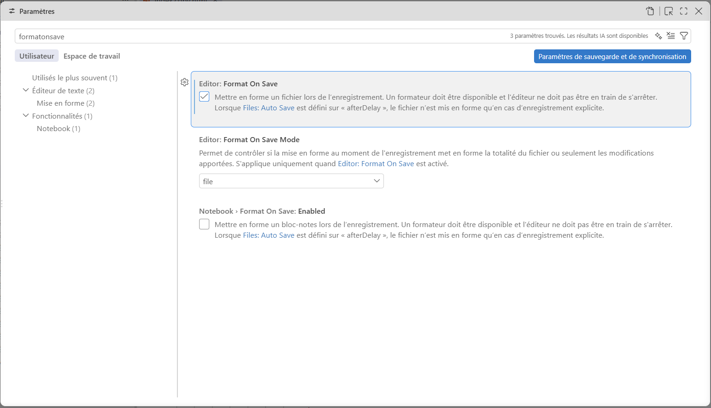
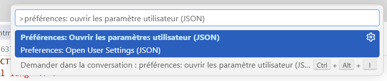
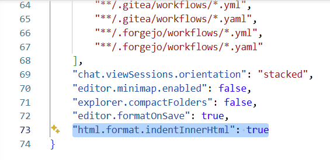

# Configuration de VSCode

Voici quelques configurations de VSCode que je vous suggère fortement d'ajouter.

## Indentation automatique

**Corriger l'indentation avec une combinaison de touches**

Utilisez la combinaison suivante dans votre fichier : `Shift + Alt + F`

**Corriger l'indentation automatiquement lors de l'enregistrement d'un fichier.**

- Ouvrez les paramètres de VSCode (Fichier -> Préférences -> Paramètres)
- Faites une recherche pour le terme **FormatOnSave**
- Cochez la case **Editor : Format On Save**

<figure markdown>

{.center .shadow}

<figcaption></figcaption>

</figure>

**Ajouter une indentation aux balise <head\> et <body\>**

- Entrez la combinaison de touche `Ctrl + Shift + P`
- Faites une recherche pour **Préférences: Ouvrir les paramètres utilisateur (JSON)**.

<figure markdown>
  {.center .shadow}
  <figcaption>Attention à choisir l'option JSON.</figcaption>
</figure>
     
              
                      
- Ajoutez à la fin du fichier la ligne suivante : `"html.format.indentInnerHtml": true`

<figure markdown>
  {.center .shadow}
  <figcaption></figcaption>
</figure>