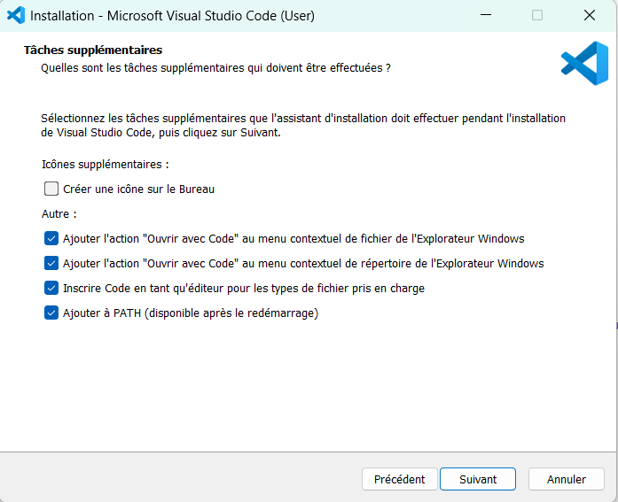

# Environnement de développement intégrée (IDE) 
VSCode en tant qu'environnement de développement intégré (IDE)

Un IDE est l'application dans laquelle vous allez développer vos projet. Elle est là pour vous aider à être plus efficace et performant (et aussi à nous sauver beaucoup de temps). Les sites web que nous allons créer dans le cadre du cours seront relativement simple et on pourrait très bien tout faire dans le bon vieux bloc-note mais svp donnez vous une chance et installez un bon IDE. Il en existe beaucoup sur le marché, je vous propose d'utiliser VSCode qui remplira très bien nos besoins.

## Installation de VSCode

Téléchargez et installez la dernière version pour votre système d'exploitation sur le site officiel : [https://code.visualstudio.com/](https://code.visualstudio.com/){:target="_blank"}.

Lors de l'installation, conservez toutes les options par défaut à part pour cette écran où je vous conseille de cocher les deux options "Ajouter l'action Ouvrir avec Code au menu ...". Ça vous permettra d'ouvrir un répertoire ou un fichier directement dans VSCode depuis le menu contextuel (clic droit sur le fichier).

<figure markdown>
  {.center .shadow}
  <figcaption>Options d'installation</figcaption>
</figure>

## Extensions

Visual Studio Code permet d'installer une multitude d'extensions pour personnaliser notre environnement. Je vous en conseille quelque une que je trouve utile pour le développement web. Pour installer une extension, ouvrez VSCode et dans l'onglet "Extensions" de la barre de menu à gauche vous pouvez faire une recherche de l'extension à installer.

### [Live server](https://marketplace.visualstudio.com/items?itemName=ritwickdey.LiveServer){:target="_blank"}

Démarre un serveur web qui vous permet de visualiser le résultat de notre page dans notre navigateur par défaut. Le gros avantage est que dès qu'une modification dans un fichier est enregistrée, la page se rafraichis automatiquement.

### [Open in browser](https://marketplace.visualstudio.com/items?itemName=techer.open-in-browser){:target="_blank"}

Ajoute une option dans le menu contextuel de l'explorateur de fichier de vscode qui permet d'ouvrir le fichier dans un navigateur. Pratique si on veut visualiser rapidement le résultat d'un fichier.

### [Prettier](https://marketplace.visualstudio.com/items?itemName=esbenp.prettier-vscode){.target="_blank"}

Format le code selon le type de langage. L'extension est configurable à souhait, on peut même lancer le reformage à chaque enregistrement.

### [Snippet Creator](https://marketplace.visualstudio.com/items?itemName=wware.snippet-creator){:target="_blank"}

Un "snippet" est un extrait de code qu'on peut réutiliser. Il y a déjà une mécanique pour le faire dans VSCode mais cet extension simplifie grandement le processus. On surligne l'extrait de code qu'on veut créer, on lance une commande et voilà.

### [HTML CSS Support](https://marketplace.visualstudio.com/items?itemName=ecmel.vscode-html-css){.target="_blank"}

Ajoute de l'autocompletion pour les nom de class et de id en HTLM et CSS.

### [Project Templates](https://marketplace.visualstudio.com/items?itemName=cantonios.project-templates){:target="_blank"}

Vous allez vite vous rendre compte que nos pages web vont avoir sensiblement toutes la même structure de départ (un fichier index.html, un répertoire css, js, etc...). Cet extension nous permet de créer un gabarit de projet qu'on peut rappeller à volonter. Bien configuré, votre gabarit peut vous faire gagner beaucoup de temps lors de la création d'un nouveau projet.

### [Material Icon Theme](https://marketplace.visualstudio.com/items?itemName=PKief.material-icon-theme){:target="_blank"}

Un thème qui remplace les icônes de base de l'explorateur de fichiers de VSCode.

### [W3C Validator](https://marketplace.visualstudio.com/items?itemName=CelianRiboulet.webvalidator){:target="_blank"}

Analyse un fichier HTML, détecte les erreurs de syntaxe et valide que le code est conforme au standart W3C.

## Emmet 

Emmet est un "plugin" intégré dans VSCode qui améliore beaucoup le développement en HTML et CSS. On peut générer une ligne complet de html et même tout un bloc rapidement avec une simple commande. On se débarasse aussi décrire des "<" et des ">" sans plus finir. Je vous laisse consulter la documentation pour apprendre la syntaxe. [https://docs.emmet.io/](https://docs.emmet.io/){:target="_blank"}.

Voici un petit exemple : 
``````html
ul.liste>li*4
``````

et le résultat 
``````html
<ul class="liste">
    <li></li>
    <li></li>
    <li></li>
    <li></li>
</ul> 
``````


