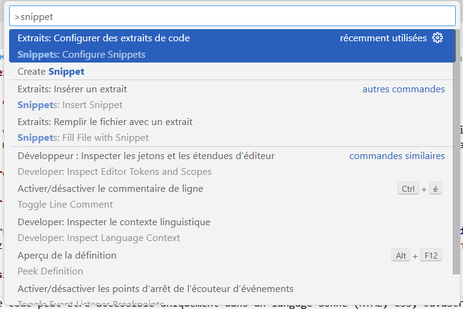
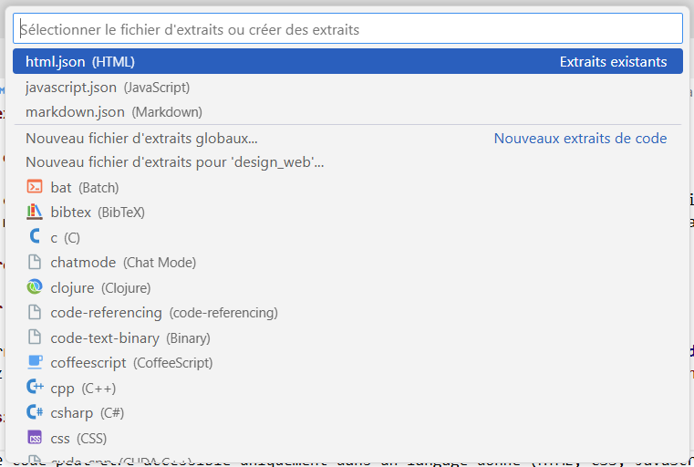

# Créer des extraits de code dans VSCode

## Qu’est-ce qu’un extrait de code (snippet)?

Un *snippet* est un bloc de code réutilisable que vous pouvez insérer rapidement dans vos fichiers. C'est très utile pour éviter d'avoir à répéter toujours les mêmes structures de codes. (ex. balises HTML, structures de fonctions, commentaires préformatés).

## Comment créer un snippet dans VSCode

### 1. Ouvrir le gestionnaire d'extraits de code

- Dans la barre de menu, aller dans **Fichier → Préférences → Configurer les extraits de code**
- Vous pouvez aussi tapez `Ctrl+Shift+P` puis recherchez `snippet` et choisir `Extraits: Configurer les extraits de code`.

<figure markdown>
  {.center .shadow}
</figure>

### 2. Choisir le langage

Un extrait de code peut être accessible uniquement dans un langage donné (HTML, CSS, JavaScript) ou bien pour tous les langages. 

- Pour spécifier un langage, vous n'avez qu'à le rechercher dans la liste (vous pouvez aussi l'entrer dans la barre de recherche) et le sélectionner.
- Choisissez `Nouveau fichier d'extrait globaux` pour créer des extraits disponible dans tous les langages. Un fichier au format JSON sera créé dans le répertoire ``.vscode` de votre projet. Si vous voulez ensuite ajouter d'autres extraits globaux, vous pouvez aller directement éditer ce fichier.


<figure markdown>
  {.center .shadow}
  <figcaption></figcaption>
</figure>

### Structure d'un extrait

Les snippets sont écrits en JSON. Voici la structure de base :

```json
{
  "Nom de l'extrait": {
    "prefix": "raccourci",
    "body": [
      "<balise>",
      "  $0",
      "</balise>"
    ],
    "description": "Insère une balise avec un curseur à l'intérieur."
  }
}
```

- **"Nom de l'extrait"** : nom interne (visible dans le fichier JSON).
- **prefix** : le mot-clé à taper pour déclencher l’extrait.
- **body** : le contenu du code à insérer. Chaque ligne est une chaîne.
    - $0 : position finale du curseur après insertion.
    - $1, $2, ... : positions intermédiaires où le curseur peut se déplacer à l'aide de la touche TAB.
    - ${1:par défaut} : texte par défaut modifiable.
- **description** : optionnelle, s’affiche dans l’info-bulle.

### Exemple

```json
{
  "Figure HTML": {
    "prefix": "fig",
    "body": [
      "<figure>",
      "  ",
      "  <figcaption>${3:Légende}</figcaption>",
      "</figure>"
    ],
    "description": "Insère une balise figure avec image et légende."
  }
}
```

En tappant fig et ensuite TAB l'extrait va s'insérer à la position du curseur.

## Modifier un extrait

- Vous n'avez qu'à ouvrir le gestionnaire d'extraits de code comme quand vous créez un nouvel extrait et ensuite sélectionner le fichier correspondant au langage de votre extrait. 
- Dans le fichier JSON retrouvez votre extrait, faites vos modifications et enregistrez le fichier.

## L'extension Snippet Creator

Avec l'extension [Snippet Creator](https://marketplace.visualstudio.com/items?itemName=wware.snippet-creator){target=_blank}, vous pouvez sélectionner le code directement dans un fichier ouvert de votre éditeur et créer un extrait de code.

1. Installez l'extension
2. Surlignez le code que vous voulez utiliser pour l'extrait de code.
3. Lancer la commande `Create Snippet` (`Ctrl+Shift+P` puis recherchez `Create Snippet`)
4. Suivez les instructions à l'écran
