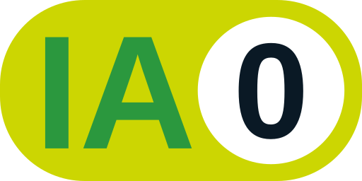
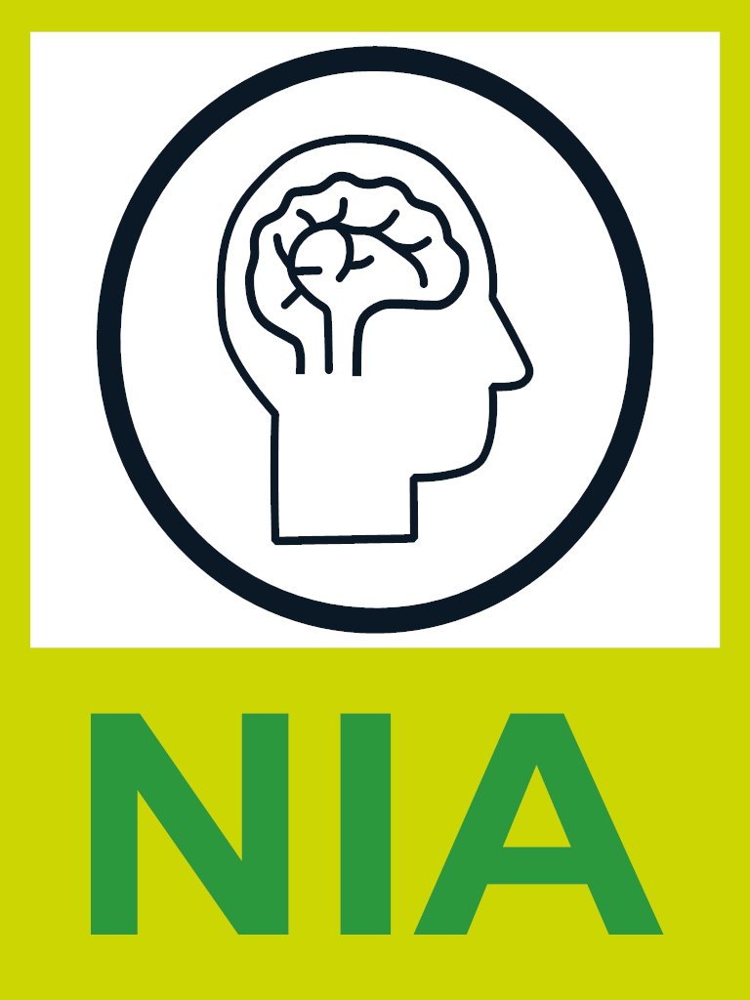

# Utilisation de l'intelligence artificielle

## Utilisation générale

Je vous déconseille fortement d'utiliser l'intelligence artificielle dans vos apprentissages. Ce cours est une initiation à la programmation web
et il est important que vous maitrisiez bien les concepts qui seront couvert. Si jamais vous voulez utiliser l'intelligence artificielle gardez en tête
les principes suivants: 

- j'ai essayé de trouver la réponse par moi-même avant d'y avoir recours.
- c'est un tuteur qui est là pour m'expliquer des concepts et non me donner la réponse.
- je dois toujours contrevérifier l'information qu'elle me donne.
- je ne copirez jamais d'extrait de code généré par une intelligence artificielle sans le comprendre.

## Utilisation en contexte d'évaluation

    <a href="https://techinfo.profinfo.ca/niveaux-ia/" target="_blank">
        
        Aucune assistance
    </a>

L'utilisation en évaluation est strictement interdite. Tout manquement à cette restriction peut être sujet aux sanctions applicables (tricherie et plagiat, retrait de la classe ou refus de répondre aux questions) telles que décrites dans la PDEA.

## Utilisation dans la conception des notes et activités

<section class="niveau-ia-production">
    

            
    

    
    <divc class="colonne-description">
        Non-recours à l’intelligence artificielle

        
Sauf indication contraire, aucune intelligence artificielle n'a été utilisé 
        dans la conception de ces notes de cours, des activités d'apprentissages et des
        évaluations.

    

</section>